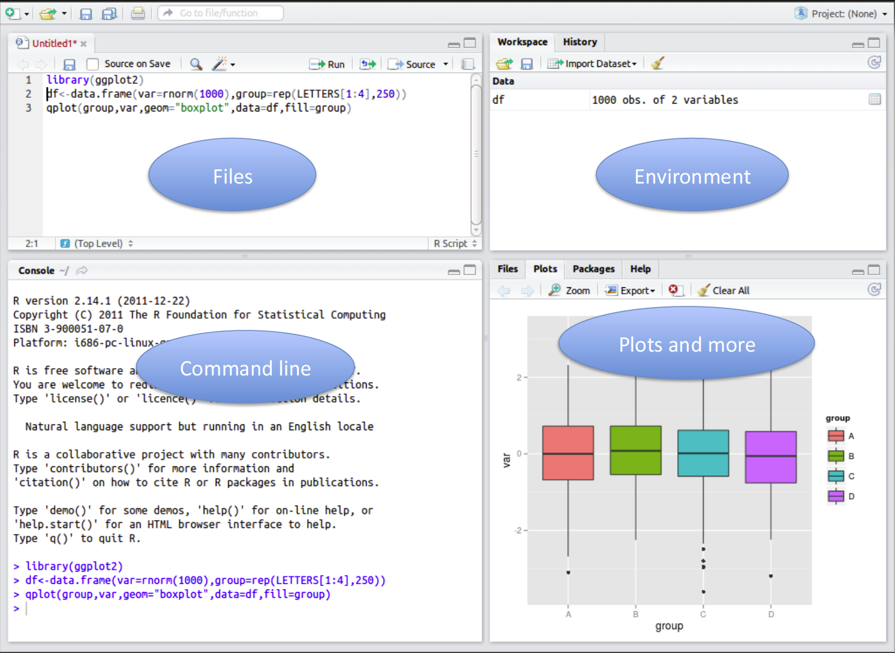
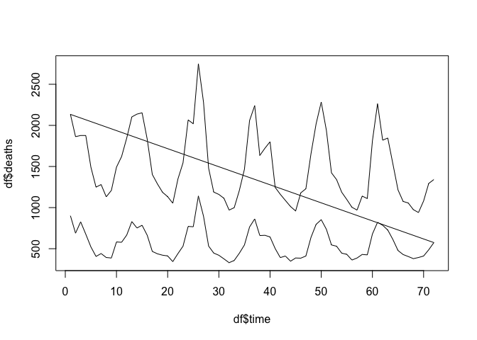
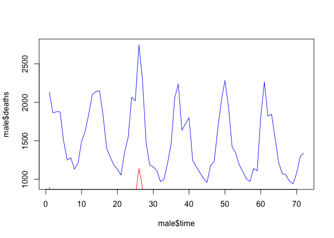
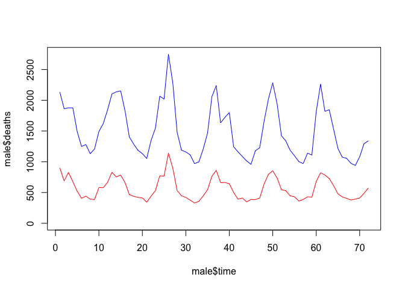
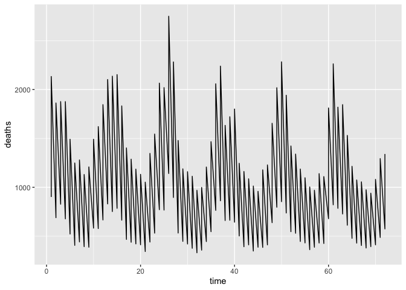
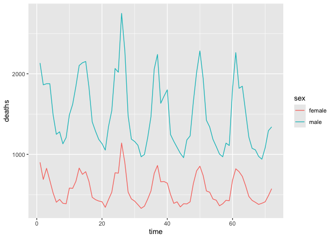
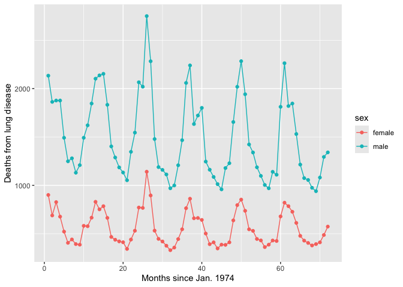
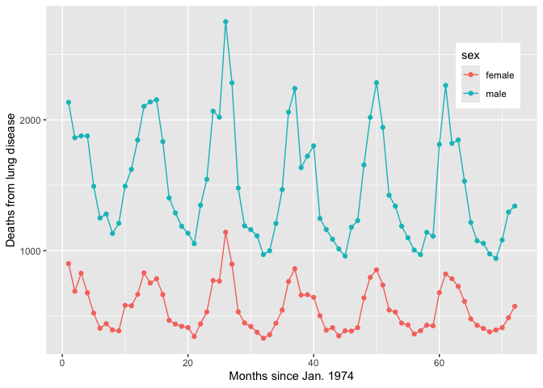
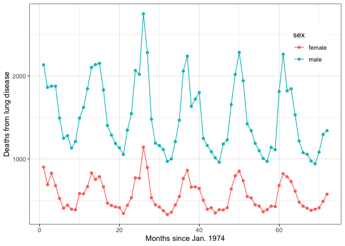

Exercises in Population Genetics
================
Dr. Robert Kofler

# Introduction

## Why R?

Why are we using the **R** programming language?

- widely used
- open source (we do not have to pay)
- available on most operating systems (Windows, Mac, Linux)
- powerful
- many libraries are available (Bioconductor)
- easy to learn

## Short history of R

- AT&T (American Telecom and Telegraph Company) developed the
  language S. S is short for statistics and alludes to the other
  language developed by AT&T around the same time: the famous C language
- S was sold to the small company TIBCO, which added a grapical user
  interface on top of S and sells the product as S-PLUS
- R was conceived 1992 by Ross Ihaka and Robert Gentleman who added
  lexical scoping on top of S. Robert Gentleman is also the founding
  father of Bioconductor, probably the most widly used package for
  Bioinformatics, and now works for 23andMe.
- A first stable beta version of R was released 2000
- R is distributed under GNU Public licence

## Requirements

- The R language <https://cran.r-project.org> (free)
- R studio <https://www.rstudio.com> (free)
- R libraries:
  - ggplot2

### How to install missing R packages

``` r
install.packages("ggplot2")
```

## Recommended Readings

- Philip W. Hedrick: Genetics of Populations
- Norman Matloff: The Art of R Programming
- Michael C. Crawley: Statistics - an Introduction using R
- Winston Chang: R Graphics Cookbook

# Loading data into R

## Open RStudio



## Obtain the data

Lets first download the dataset **lungdeaths.txt** from my webpage
<http://drrobertkofler.wikispaces.com/PopgenExercises> Store it
somewhere on your computer and obtain the absolute path to the file.
Than let’s have a look at the data using the UNIX command **head**

``` bash
# enter the command line
# replace the path with your path
head /Users/rokofler/My Drive/Teaching/PopGenExercises/material/lungdeaths.txt
```

These data contain the number of monthly deaths of lung disease
(bronchitis, asthma, etc) in the UK from 1974 to 1979, for males and
females separately. The data have three columns

- column 1: time of measurement, starting to count on Jan 1974 with 1
  and ending Dec. 1979 with 72
- column 2: male or female
- column 3: number of deaths in the given months

## Load the data into R

``` r
# again use the absolute path from above
df<-read.table("/Users/rokofler/gh/PopGenLecture/Basics/lungdeaths.txt")
# and inspect the data using either head or tail functions
head(df)
```

    ##   V1     V2  V3
    ## 1  1 female 901
    ## 2  2 female 689
    ## 3  3 female 827
    ## 4  4 female 677
    ## 5  5 female 522
    ## 6  6 female 406

- With the method read.table we loaded the data into a **dataframe**
  which is a standard data format in R, it is a matrix where columns may
  have different data types (modes). Most statistical analysis is
  performed with data.frames; a dataframe corresponds to SAS and SPSS
  datasets.
- **\<-** assigning the dataframe to variable d; Assignment with “=” is
  possible but discouraged as this may lead to weird errors.
- quotations (“) mark a string
- head() displays the first few lines of a dataframe (or list, vector,
  matrix)

Example, assigning a value to variable

``` r
v <- 2
print(v) 
```

    ## [1] 2

``` r
# print is not necessary, just typing v can also be used to display the content of v
v
```

    ## [1] 2

``` r
v <- v+2
print(v)
```

    ## [1] 4

What is the result of?

``` r
v <- 1
v <- v+2
v <- v+3
v <- v+4
v <- v+5
print(v)
```

Basic operations with R:

- addition +
- subtraction -
- multiplication \*
- division /
- exponentiation ^

## Getting help for functions

``` r
# show documentation for the head metho
?head
# search for anything containing head in the R documentation
??head
```

## Getting infos about data

In R you are confronted with many different data types like lists,
dataframes, matrices, vectors etc. So how to get info about variables?

### 1. List all loaded objects

``` r
ls()
```

    ## [1] "df" "v"

### 2. Size of an object

``` r
length(df) # length of object, here number of columns
```

    ## [1] 3

``` r
nrow(df) # number of rows
```

    ## [1] 144

``` r
dim(df) # dimensions of object
```

    ## [1] 144   3

### 3. Class of a variable

``` r
class(df)
```

    ## [1] "data.frame"

### 4. Names of an object

``` r
names(df)
```

    ## [1] "V1" "V2" "V3"

### 5. Structure of an object

``` r
# one of the most helpful and important commands
str(df) # structure
```

    ## 'data.frame':    144 obs. of  3 variables:
    ##  $ V1: int  1 2 3 4 5 6 7 8 9 10 ...
    ##  $ V2: chr  "female" "female" "female" "female" ...
    ##  $ V3: int  901 689 827 677 522 406 441 393 387 582 ...

## Assign descriptive names to columns

The column names of our dataframe are “V1”, “V2”, and “V3” this is not
very descriptive. Lets assign more useful column names

``` r
names(df)<-c("time","sex","deaths")
head(df)
```

    ##   time    sex deaths
    ## 1    1 female    901
    ## 2    2 female    689
    ## 3    3 female    827
    ## 4    4 female    677
    ## 5    5 female    522
    ## 6    6 female    406

### Vectors

There are several ways of creating vectors in R, where an vector is just
a collection of elements

#### Direct definition

``` r
# command c(), which is short for concatenate
a<- c(1,2,5.3,-5,7) # numeric vector; integer vectors are also possible
b<-c("hello","this","is","a","string","vector") # string vector
c<-c(TRUE,FALSE,TRUE,FALSE) # boolean vector
print(a)
```

    ## [1]  1.0  2.0  5.3 -5.0  7.0

``` r
print(b)
```

    ## [1] "hello"  "this"   "is"     "a"      "string" "vector"

``` r
print(c)
```

    ## [1]  TRUE FALSE  TRUE FALSE

The data type (numeric, string, boolean) is called **mode**. So **a** is
a vector with mode numeric, **b** is a vector of mode string.

#### Defining series

``` r
# a vector from 1 to 10
d<-1:10
print(d)
```

    ##  [1]  1  2  3  4  5  6  7  8  9 10

``` r
# repeat something multiple times
# creating a typical conversation that I overheard in Cataluna ;)
e<-rep("vale",10)
print(e)
```

    ##  [1] "vale" "vale" "vale" "vale" "vale" "vale" "vale" "vale" "vale" "vale"

``` r
# create a sequence from 100 to 200 with steps of 10
f<-seq(100,200,10)
print(f)
```

    ##  [1] 100 110 120 130 140 150 160 170 180 190 200

#### Scalars are actually vectors of sice 1

``` r
# This is actually a vector assignment
# A vector of size 1, which is called scalar
v <- 1
```

#### Adding vs. concatenating two vectors

``` r
a<-1:11
# generate a sequence from 100 to 200 with steps of 10
b<-seq(100,200,10)
print(a+b)
```

    ##  [1] 101 112 123 134 145 156 167 178 189 200 211

``` r
print(c(a,b))
```

    ##  [1]   1   2   3   4   5   6   7   8   9  10  11 100 110 120 130 140 150 160 170
    ## [20] 180 190 200

#### Recycling

``` r
a<-1:10      # length 10
b<-c(10,20)  # length 2
# So what will happen when we add a (length 10) and b (length 2)?

print(a+b)
```

    ##  [1] 11 22 13 24 15 26 17 28 19 30

#### Scalar operations are actually recycling

``` r
a<-1:10 
b<-10 
c<-a+b
# Here 10 is actually recycled 10 times
# remember scalars are vectors of size 1
print(c)
```

    ##  [1] 11 12 13 14 15 16 17 18 19 20

#### Info about Vectors

``` r
a<-1:10 
length(a)
```

    ## [1] 10

``` r
mode(a)
```

    ## [1] "numeric"

## Summary of R data types

- modes: **numeric**, **integer**, **string**, **boolean**, factor
- single mode collections: **vector**, matrix (2D vector)
- mixed mode collections: list, **dataframe**

## Factors

Let’s again look at our data.structure

``` r
str(df)
```

    ## 'data.frame':    144 obs. of  3 variables:
    ##  $ time  : int  1 2 3 4 5 6 7 8 9 10 ...
    ##  $ sex   : chr  "female" "female" "female" "female" ...
    ##  $ deaths: int  901 689 827 677 522 406 441 393 387 582 ...

It mentions that column 2 (sex) is a factor with 2 levels: “male” and
“female”, so what is a factor?

Factors are used to describe discrete categories

- eye color: brown, green, blue
- sex in our list: female, male
- sex in other lists: androgyn, bigender, male, female, genderqueer,
  gender variabel, female to male, male to female, pangender, trans,
  transfemale, transmale….
- living status: death, alive
- any othes?

How to generate a factor?

``` r
# starting from a vector, eg:
s<-c("f","m","f","m","f","f")
asf<-as.factor(s)
print(s)
```

    ## [1] "f" "m" "f" "m" "f" "f"

``` r
print(asf)
```

    ## [1] f m f m f f
    ## Levels: f m

You see, strings and factors are entirely different!

## Accessing elements of vectors and dataframes

### Acessing elements of a vector

``` r
a <- c(5 ,4 ,3 ,2 ,1)
# print the first element
print(a[1])
```

    ## [1] 5

``` r
# print the third element
print(a[3])
```

    ## [1] 3

### Acessing elements of a data frame

``` r
# with the dollar operator
print(df$sex)
```

    ##   [1] "female" "female" "female" "female" "female" "female" "female" "female"
    ##   [9] "female" "female" "female" "female" "female" "female" "female" "female"
    ##  [17] "female" "female" "female" "female" "female" "female" "female" "female"
    ##  [25] "female" "female" "female" "female" "female" "female" "female" "female"
    ##  [33] "female" "female" "female" "female" "female" "female" "female" "female"
    ##  [41] "female" "female" "female" "female" "female" "female" "female" "female"
    ##  [49] "female" "female" "female" "female" "female" "female" "female" "female"
    ##  [57] "female" "female" "female" "female" "female" "female" "female" "female"
    ##  [65] "female" "female" "female" "female" "female" "female" "female" "female"
    ##  [73] "male"   "male"   "male"   "male"   "male"   "male"   "male"   "male"  
    ##  [81] "male"   "male"   "male"   "male"   "male"   "male"   "male"   "male"  
    ##  [89] "male"   "male"   "male"   "male"   "male"   "male"   "male"   "male"  
    ##  [97] "male"   "male"   "male"   "male"   "male"   "male"   "male"   "male"  
    ## [105] "male"   "male"   "male"   "male"   "male"   "male"   "male"   "male"  
    ## [113] "male"   "male"   "male"   "male"   "male"   "male"   "male"   "male"  
    ## [121] "male"   "male"   "male"   "male"   "male"   "male"   "male"   "male"  
    ## [129] "male"   "male"   "male"   "male"   "male"   "male"   "male"   "male"  
    ## [137] "male"   "male"   "male"   "male"   "male"   "male"   "male"   "male"

``` r
# the first element of the sex vector
print(df$sex[1])
```

    ## [1] "female"

### Assigning elements to a data frame

``` r
# now lets define the species of the data points
df$species<-rep("human",144)
head(df)
```

    ##   time    sex deaths species
    ## 1    1 female    901   human
    ## 2    2 female    689   human
    ## 3    3 female    827   human
    ## 4    4 female    677   human
    ## 5    5 female    522   human
    ## 6    6 female    406   human

### Excersice

Assign a new column, sexshort, having the two factors “m” and “f”
instead of “male” and “female”

# Visualizing data with R

## Libaries for data visualization

- standard library:
- ggplot2: very powerful; beautiful graphs; very flexible; simple to
  usage; increasingly used in bioinformatics and data visualization
- lattice: faster than ggplot2, graphs are not as beautiful

I will mostly focus on ggplot2 but also show some examples using the
standard library

## Death rates for males and females using the standard library

``` r
plot(df$time,df$deaths,type="l")
```

<!-- -->

Thats ugly, so its best to first plot the males and only than add the
females to the plot

### Subsets of data frames

``` r
male<-subset(df,sex=="male")
female<-subset(df,sex=="female")
```

### Plot males and females separately

``` r
plot(male$time,male$deaths,type="l",col="blue")
lines(female$time,female$deaths,col="red")
```

<!-- -->

### ylim

That’s still ugly, R is first plotting the males (within the male range)
and than adding the females on top of that. Thus the females are lost.

``` r
plot(male$time,male$deaths,type="l",col="blue",ylim=c(0,max(male$deaths)))
lines(female$time,female$deaths,col="red")
```

<!-- -->

### Exercise

Add another line to the graph representing the sum of males and females;
use black for this sum

## Death rates for males and females using ggplot2

First load the ggplot2 library

``` r
library(ggplot2)
```

And than we plot it with ggplot

``` r
# First set the data (df)
# Second aes... aesthetics, describe how to map the data to the plot
# Only last, we define that the plot is a line plot!
g<-ggplot(df,aes(x=time,y=deaths))+geom_line()
plot(g)
```

<!-- -->

Any ideas of what whent wrong here?

Lets try again.

``` r
# add color to aesthetics
# i.e. one line for every factor
g<-ggplot(df,aes(x=time,y=deaths,color=sex))+geom_line()
plot(g)
```

<!-- -->

It’s easy to add points to the graph, order text to the achsis

``` r
# geom_point(), ylab(), xlab()
g<-ggplot(df,aes(x=time,y=deaths,color=sex))+geom_line()+geom_point()+xlab("Months since Jan. 1974")+ ylab("Deaths from lung disease")
plot(g)
```

<!-- -->

Move the legend into the text

``` r
# theme(legend.position=c())
g<-ggplot(df,aes(x=time,y=deaths,color=sex))+geom_line()+geom_point()+xlab("Months since Jan. 1974")+ ylab("Deaths from lung disease")+
  theme(legend.position=c(0.9,0.8))
plot(g)
```

<!-- -->

Set a different background Move the legend into the text

``` r
theme_set(theme_bw()) # set to black and white background
# the default background can be restored with theme_set(theme_grey())
# Note: a background is active for one R session
g<-ggplot(df,aes(x=time,y=deaths,color=sex))+geom_line()+geom_point()+xlab("Months since Jan. 1974")+ ylab("Deaths from lung disease")+
  theme(legend.position=c(0.9,0.8))
plot(g)
```

<!-- -->

Safe the plot to a file

``` r
# first create the plot as usual and store it in variable g
g<-ggplot(df,aes(x=time,y=deaths,color=sex))+geom_line()+geom_point()
+xlab("Months since Jan. 1974")+ ylab("Deaths from lung disease")+
  theme(legend.position=c(0.9,0.8))

# open a connection to a pdf file, all output will be stored there
pdf("/Users/robertkofler/iprof/lectures/PopGenExercises/testoutput.pdf")
plot(g) 
dev.off() # device off, finalize plotting and stop access to the pdf
```

Now open your finder and admire your nice pdf plot

Finally lets adjust the size of the output pdf

``` r
g<-ggplot(df,aes(x=time,y=deaths,color=sex))+geom_line()+geom_point()
+xlab("Months since Jan. 1974")+ ylab("Deaths from lung disease")+
  theme(legend.position=c(0.9,0.8))

pdf("/Users/robertkofler/iprof/lectures/PopGenExercises/testoutput2.pdf",width=3,height=3) # inches
plot(g) 
dev.off() 
```
