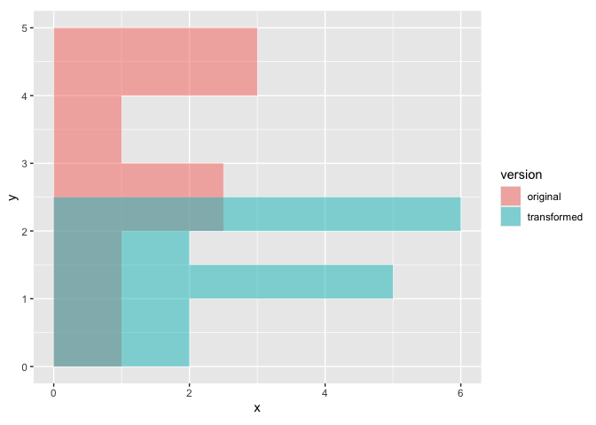
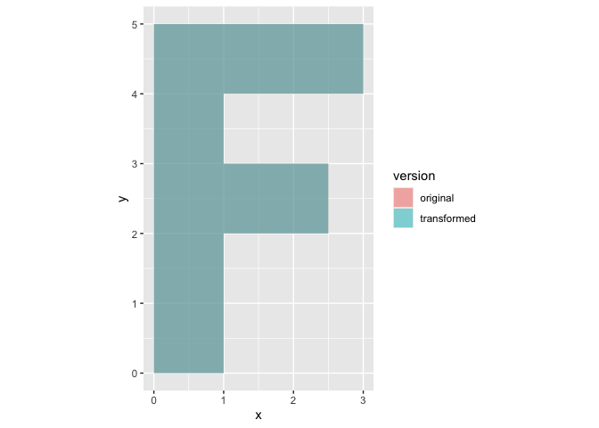
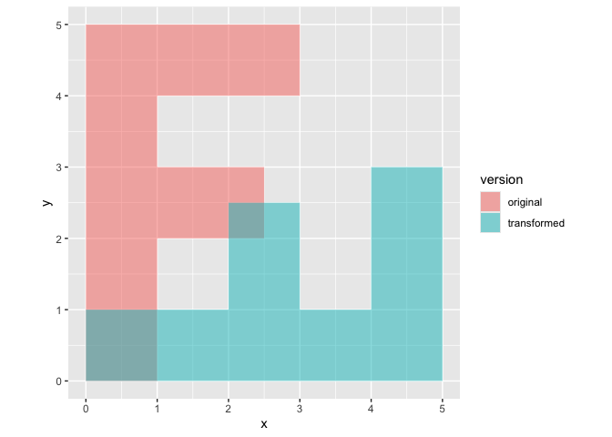
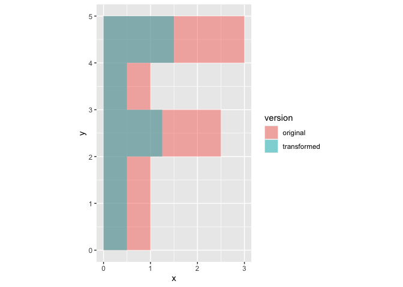
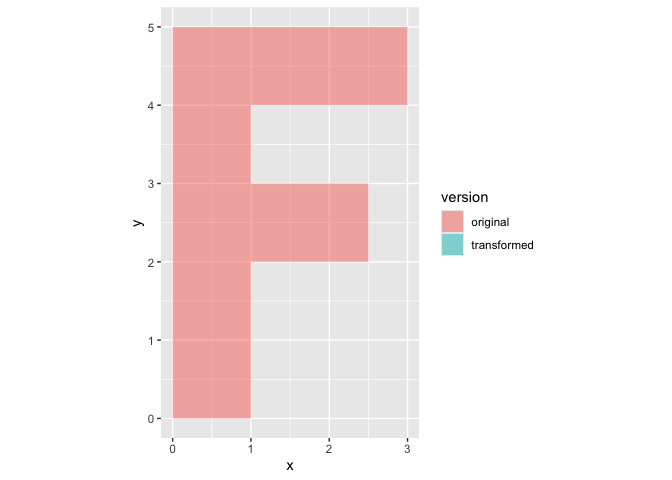
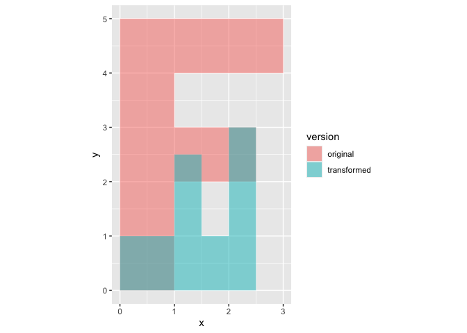

basicFunctions
================
2026-10-07

## Where we are

- load data into R (read.table())
- work with vectors, factors and data frames
- access elements with \[ \] and \$
- make first plots with the standard library and with ggplot2

## Today we learn

- write own functions
- automate repetitive work with loops, sapply and replicate
- make decisions with if/else
- work with matrices and matrix multiplication
- explore an interesting data set: how much do mammals sleep
- more essentials of the standard graphics library
- learn more ggplots

# Functions and apply

## simple functions; single parameter

Lets start with the most simple one

``` r
square<-function(a)
{
  s=a*a
return (s)
}

# lets use it
test<-square(5)
print(test)
```

    ## [1] 25

It also works with irregular parameters

``` r
test<-square(TRUE)
print(test)
```

    ## [1] 1

## simple functions; multiple parameters

``` r
rectangle<-function(a,b)
{
  a=a*b
return (a)
}

# lets use it
ra<-rectangle(5,4)
print(ra)
```

    ## [1] 20

## simple functions; multiple rectangles

Now we want to compute the area of multiple rectangles. How to best do
this?

``` r
a<- c(10,50,80,90)
b<- c(40,20,30,40)
```

## Classically with a for loop

``` r
# preallocate the vector with the results:
area <- numeric(length(a))
for (i in 1:length(a)) {
  area[i] <- rectangle(a[i], b[i])
}
print(area)
```

    ## [1]  400 1000 2400 3600

## vectorization

But actually R is vectorized, hence we can do it much simpler!

``` r
area <-  rectangle(a, b)
print(area)
```

    ## [1]  400 1000 2400 3600

## can all functions be vectorized?

What about this one:

``` r
# find the longer side of a rectangle a, b
longer_side <- function(a, b) {
  max(a, b)
}
```

Lets try with two values

``` r
print(longer_side(10,30))
```

    ## [1] 30

``` r
print(longer_side(35,1))
```

    ## [1] 35

now with our vector

``` r
a<- c(10,50,80,90)
b<- c(40,20,30,40)
print(longer_side(a,b))
```

    ## [1] 90

How to deal with this problem?

- Solution 1: loop - see above

- Solution 2: mapply (multi apply)

## mapply

``` r
long<-mapply(longer_side,a,b)
print(long)
```

    ## [1] 40 50 80 90

## sapply and if/else

I want to know if i sleep enough. So i make a function giving me the
answer

``` r
sleep_enough <- function(hours) {
  var<-""
  if (hours >= 14) {
    var<-"more than enough"
  } else if (hours >= 8) {
    var<-"enough"
  } else {
    var<-"short"
  }
  return(var)
}
```

Do I sleep enough

``` r
# Lets see, do i sleep enough?
print(sleep_enough(7))
```

    ## [1] "short"

can i use this function with multiple people?

``` r
mp<-c(1,7,8,14,12,1)
#print(sleep_enough(mp))
# no i get an error! 
```

One solution is sapply

``` r
mp<-c(1,7,8,14,12,1)
res<-sapply(mp,sleep_enough)
print(res)
```

    ## [1] "short"            "short"            "enough"           "more than enough"
    ## [5] "enough"           "short"

**To summarize: apply applies a function to single (sapply) or multiple
(mapply) values**

## replicate

Similar to sapply, allows you to execute a function a given number of
times; it is only useful for random processes as otherwise you always
get the same results

``` r
rep<-replicate(5,square(20))
print(rep)
```

    ## [1] 400 400 400 400 400

``` r
rep<-replicate(5,rnorm(1))
print(rep)
```

    ## [1] 0.79246298 0.34994270 0.08460286 0.58432475 0.41548076

``` r
# this was just for demonstration; because actually...
rep<-rnorm(5)
print(rep)
```

    ## [1] -0.07358416  1.19645884 -0.11925809  0.76170357  1.73102346

# Matrices

## generate a simple 2x2 matrix

``` r
# we need to start with a vector
vec<-c(1, 2, 3, 4)
print(vec)
```

    ## [1] 1 2 3 4

``` r
# and distort it into a matrix
m<-matrix(vec,nrow=2)
print(m)
```

    ##      [,1] [,2]
    ## [1,]    1    3
    ## [2,]    2    4

We can also generate the matrix by row

``` r
# by row
m<-matrix(vec,nrow=2,byrow=TRUE)
print(m)
```

    ##      [,1] [,2]
    ## [1,]    1    2
    ## [2,]    3    4

## subsets of matrices

``` r
m<-matrix(c(1, 2, 3, 4),nrow=2)
print(m)
```

    ##      [,1] [,2]
    ## [1,]    1    3
    ## [2,]    2    4

``` r
print(m[1,2])
```

    ## [1] 3

``` r
print(m[2,1])
```

    ## [1] 2

Or we can print entire rows:

``` r
print(m[1,])
```

    ## [1] 1 3

``` r
print(m[2,])
```

    ## [1] 2 4

Or print entire columns:

``` r
print(m[,1])
```

    ## [1] 1 2

``` r
print(m[,2])
```

    ## [1] 3 4

## What are matrices?

### to illustrate the transforming powers of matrices lets make a letter F based on coordinates

``` r
fletter <- matrix(c(0, 0,   1, 0,   1, 2,   2.5, 2,   2.5, 3,
                  1, 3,   1, 4,   3, 4,   3, 5,     0, 5), nrow = 2)
print(fletter)
```

    ##      [,1] [,2] [,3] [,4] [,5] [,6] [,7] [,8] [,9] [,10]
    ## [1,]    0    1    1  2.5  2.5    1    1    3    3     0
    ## [2,]    0    0    2  2.0  3.0    3    4    4    5     5

How is this an F? lets visualize with our favorite ggplot2

``` r
library(ggplot2)
# geom polygon, provide all points of a polygon, and the points will be connected like in the children game, where you connected the dots
df<-data.frame(x = fletter[1, ], y = fletter[2, ])
g<-ggplot(df, aes(x = x, y = y)) +
  geom_polygon(fill = "steelblue", alpha = 0.6) + coord_equal()
plot(g)
```

<!-- --> \###
so what is a matrix doing to our F-letter?

``` r
scalematrix <- matrix(c(2, 0, 0, 0.5), nrow = 2, byrow = TRUE)
print(scalematrix)
```

    ##      [,1] [,2]
    ## [1,]    2  0.0
    ## [2,]    0  0.5

``` r
# matrix multiplication %*%
scaledletter <- scalematrix %*% fletter
print(scaledletter)
```

    ##      [,1] [,2] [,3] [,4] [,5] [,6] [,7] [,8] [,9] [,10]
    ## [1,]    0    2    2    5  5.0  2.0    2    6  6.0   0.0
    ## [2,]    0    0    1    1  1.5  1.5    2    2  2.5   2.5

visualize scaled matrix

``` r
df <- data.frame(x = c(fletter[1, ], scaledletter[1, ]),
                 y = c(fletter[2, ], scaledletter[2, ]),
                 version = rep(c("original", "transformed"), each = ncol(fletter)))
print(df)
```

    ##      x   y     version
    ## 1  0.0 0.0    original
    ## 2  1.0 0.0    original
    ## 3  1.0 2.0    original
    ## 4  2.5 2.0    original
    ## 5  2.5 3.0    original
    ## 6  1.0 3.0    original
    ## 7  1.0 4.0    original
    ## 8  3.0 4.0    original
    ## 9  3.0 5.0    original
    ## 10 0.0 5.0    original
    ## 11 0.0 0.0 transformed
    ## 12 2.0 0.0 transformed
    ## 13 2.0 1.0 transformed
    ## 14 5.0 1.0 transformed
    ## 15 5.0 1.5 transformed
    ## 16 2.0 1.5 transformed
    ## 17 2.0 2.0 transformed
    ## 18 6.0 2.0 transformed
    ## 19 6.0 2.5 transformed
    ## 20 0.0 2.5 transformed

``` r
g<-ggplot(df, aes(x = x, y = y, fill = version)) +
  geom_polygon(alpha = 0.5) +
  coord_equal()
plot(g)
```

<!-- --> \###
now lets turn this into a function

``` r
transform<-function(letter,matrix)
{
  # first transform
  trans<-matrix %*% letter
  # second store in dataframe
  df <- data.frame(x = c(letter[1, ], trans[1, ]),
                 y = c(letter[2, ], trans[2, ]),
                 version = rep(c("original", "transformed"), each = ncol(fletter)))
  # third visualize with ggplot2
  g<-ggplot(df, aes(x = x, y = y, fill = version)) +
    geom_polygon(alpha = 0.5) +
    coord_equal()
  plot(g)
}
```

### lets transform our letter with multiple matrices

#### identity

``` r
id<-matrix(c(1, 0, 0, 1),nrow=2)
print(id)
```

    ##      [,1] [,2]
    ## [1,]    1    0
    ## [2,]    0    1

``` r
transform(fletter,id)
```

<!-- -->

``` r
# no change => thats why this is called identity matrix
```

#### transposing

``` r
tp<-matrix(c(0, 1, 1, 0),nrow=2)
print(tp)
```

    ##      [,1] [,2]
    ## [1,]    0    1
    ## [2,]    1    0

``` r
transform(fletter,tp)
```

<!-- -->

``` r
# transposing = exchange x and y-letters
```

#### x-scaling

``` r
xs<-matrix(c(0.5, 0, 0, 1),nrow=2)
print(xs)
```

    ##      [,1] [,2]
    ## [1,]  0.5    0
    ## [2,]  0.0    1

``` r
transform(fletter,xs)
```

<!-- -->

``` r
# x-scaling
```

### What to do when i want to i) transpose and x-scale? Matrix multiplication!

#### attempt one - the naive approach

``` r
dt1<-tp*xs
print(dt1)
```

    ##      [,1] [,2]
    ## [1,]    0    0
    ## [2,]    0    0

``` r
transform(fletter,dt1)
```

<!-- -->

``` r
# desaster, my polygon has now shrunk to a point at coordinates 0
```

#### attempt two - proper matrix multiplication

``` r
dt2<-xs %*% tp
print(dt2)
```

    ##      [,1] [,2]
    ## [1,]    0  0.5
    ## [2,]    1  0.0

``` r
transform(fletter,dt2)
```

<!-- -->

``` r
# voila, we have combined two linear transformation into a single matrix!
# transposing and x-scaling
```

# Explore interesting data set - how much do mammals sleep

**new Rmarkdown sleepStorry**
