sleep-story
================
2026-10-07

# the Dataset

``` r
library(ggplot2)
print(msleep) # comes with ggplot2
```

    ## # A tibble: 83 × 11
    ##    name   genus vore  order conservation sleep_total sleep_rem sleep_cycle awake
    ##    <chr>  <chr> <chr> <chr> <chr>              <dbl>     <dbl>       <dbl> <dbl>
    ##  1 Cheet… Acin… carni Carn… lc                  12.1      NA        NA      11.9
    ##  2 Owl m… Aotus omni  Prim… <NA>                17         1.8      NA       7  
    ##  3 Mount… Aplo… herbi Rode… nt                  14.4       2.4      NA       9.6
    ##  4 Great… Blar… omni  Sori… lc                  14.9       2.3       0.133   9.1
    ##  5 Cow    Bos   herbi Arti… domesticated         4         0.7       0.667  20  
    ##  6 Three… Brad… herbi Pilo… <NA>                14.4       2.2       0.767   9.6
    ##  7 North… Call… carni Carn… vu                   8.7       1.4       0.383  15.3
    ##  8 Vespe… Calo… <NA>  Rode… <NA>                 7        NA        NA      17  
    ##  9 Dog    Canis carni Carn… domesticated        10.1       2.9       0.333  13.9
    ## 10 Roe d… Capr… herbi Arti… lc                   3        NA        NA      21  
    ## # ℹ 73 more rows
    ## # ℹ 2 more variables: brainwt <dbl>, bodywt <dbl>

``` r
# it's a tidyverse tibble
# tidyverse and tibbles are great; but we have no time to cover tidyverse (unfortunatelly)
# so lets convert to our favorite data fram
ms <- as.data.frame(msleep)
# lets look at the data with str()
str(ms)
```

    ## 'data.frame':    83 obs. of  11 variables:
    ##  $ name        : chr  "Cheetah" "Owl monkey" "Mountain beaver" "Greater short-tailed shrew" ...
    ##  $ genus       : chr  "Acinonyx" "Aotus" "Aplodontia" "Blarina" ...
    ##  $ vore        : chr  "carni" "omni" "herbi" "omni" ...
    ##  $ order       : chr  "Carnivora" "Primates" "Rodentia" "Soricomorpha" ...
    ##  $ conservation: chr  "lc" NA "nt" "lc" ...
    ##  $ sleep_total : num  12.1 17 14.4 14.9 4 14.4 8.7 7 10.1 3 ...
    ##  $ sleep_rem   : num  NA 1.8 2.4 2.3 0.7 2.2 1.4 NA 2.9 NA ...
    ##  $ sleep_cycle : num  NA NA NA 0.133 0.667 ...
    ##  $ awake       : num  11.9 7 9.6 9.1 20 9.6 15.3 17 13.9 21 ...
    ##  $ brainwt     : num  NA 0.0155 NA 0.00029 0.423 NA NA NA 0.07 0.0982 ...
    ##  $ bodywt      : num  50 0.48 1.35 0.019 600 ...

## what are the columns

- name: common name of the species
- genus, order: taxonomy
- vore: diet; carni(vore), herbi(vore), insecti(vore), omni(vore)
- conservation: IUCN conservation status (lc = least concern, vu =
  vulnerable, en = endangered, …)
- sleep_total: total sleep (hours per day)
- sleep_rem: REM sleep (hours per day)
- sleep_cycle: length of one sleep cycle (hours)
- awake: hours awake per day (= 24 - sleep_total)
- brainwt: brain weight (kg)
- bodywt: body weight (kg)

# Lets explore various questions

## Who sleeps the most?

``` r
print(max(ms$sleep_total))
```

    ## [1] 19.9

Fantastic - but who actually is 19.9 hours? Any guesses?

``` r
which.max(ms$sleep_total)
```

    ## [1] 43

``` r
# so the index of the winner is...
```

``` r
ms[which.max(ms$sleep_total),]
```

    ##                name  genus    vore      order conservation sleep_total
    ## 43 Little brown bat Myotis insecti Chiroptera         <NA>        19.9
    ##    sleep_rem sleep_cycle awake brainwt bodywt
    ## 43         2         0.2   4.1 0.00025   0.01

``` r
# the actual winner is
```

## Whats the sleep distribution

using the standard library hist (histogram)

``` r
hist(ms$sleep_total)
```

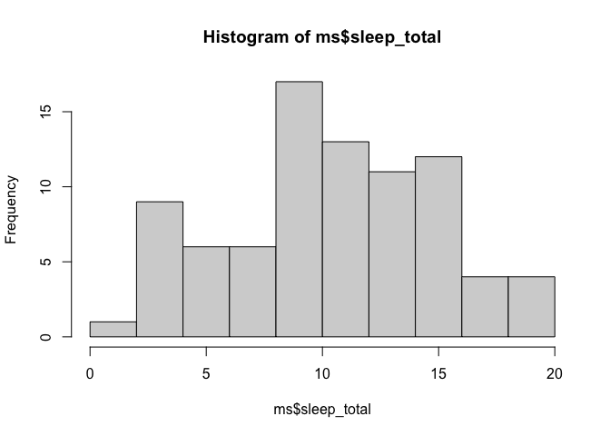<!-- --> \## Is
there a relationship between sleep and body weight?

``` r
plot(log10(ms$bodywt), ms$sleep_total, pch = 19,
     xlab = "log10 body weight (kg)", ylab = "sleep length in hours")
```

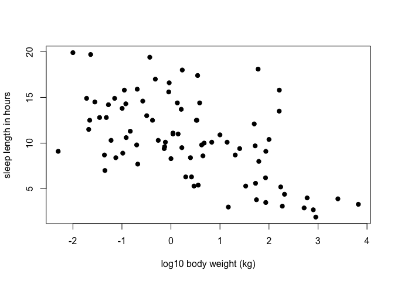<!-- -->

``` r
ms$lbw<-log10(ms$bodywt)
plot(ms$lbw, ms$sleep_total, pch = 19,
     xlab = "log10 body weight (kg)", ylab = "sleep length in hours")
fit <- lm(sleep_total ~ lbw , data = ms)
abline(fit, col = "red", lwd = 2)
```

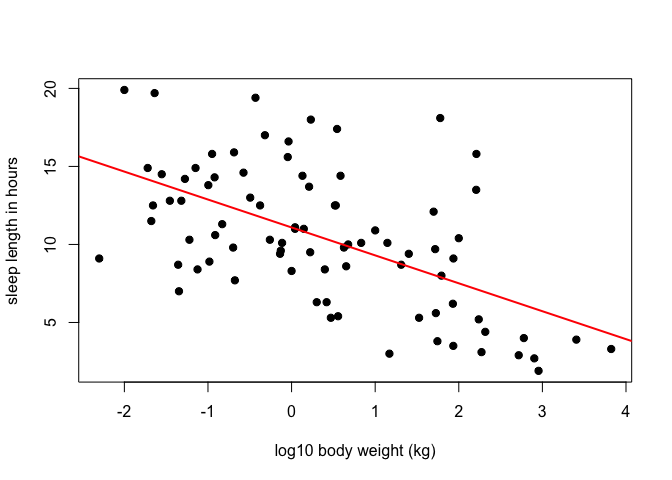<!-- -->

So thats interesting: the more heave a mammal the less it sleeps

## Lets use the standard library to look at several aspects of the data

``` r
par(mfrow = c(2, 2)) # 2 rows, 2 columns
hist(ms$sleep_total, main = "Total sleep", xlab = "hours")
hist(ms$sleep_rem, main = "REM sleep", xlab = "hours")
hist(log10(ms$bodywt), main = "Body weight", xlab = "log10 kg")
hist(log10(ms$brainwt), main = "Brain weight", xlab = "log10 kg")
```

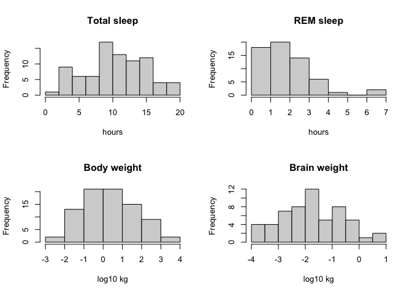<!-- --> \# Now
lets look at the data with ggplot

## Refresher ggplot (grammar of graphics):

A ggplot is built from layers that are combined with +:

- data: a data frame
- aesthetics aes(): map variables to visual properties (x, y, color,
  fill, size, shape, group, label, …)
- geoms: what to draw (geom_point(), geom_line(), geom_boxplot(), …)
- optionally scales, facets and themes

### Brain weight vs bodyweight

``` r
ggplot(ms, aes(x = bodywt, y = brainwt)) +
  geom_point() 
```

    ## Warning: Removed 27 rows containing missing values or values outside the scale range
    ## (`geom_point()`).

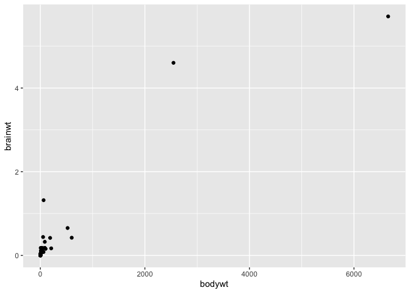<!-- --> Nice -
but we do not really see a trend. Can we do better, e.g. by making the
axis log10.

``` r
ggplot(ms, aes(x = bodywt, y = brainwt)) +
  geom_point() +
  scale_x_log10() +
  scale_y_log10()
```

    ## Warning: Removed 27 rows containing missing values or values outside the scale range
    ## (`geom_point()`).

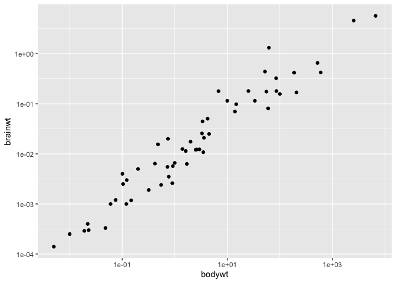<!-- --> There is
a clear trend - the more body weight the more brain weight! \### I have
a hypothesis, could this depend on the diet?

``` r
ggplot(ms, aes(x = bodywt, y = brainwt,color=vore)) +
  geom_point() +
  scale_x_log10() +
  scale_y_log10()
```

    ## Warning: Removed 27 rows containing missing values or values outside the scale range
    ## (`geom_point()`).

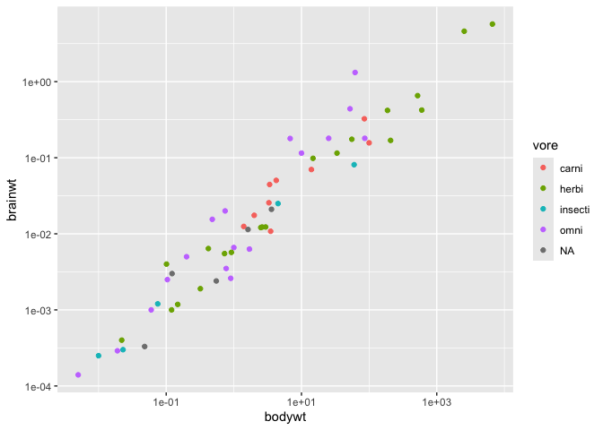<!-- -->

### Lets add a regression line

``` r
ggplot(ms, aes(x = bodywt, y = brainwt,color=vore)) +
  geom_point() +
   geom_smooth(method = "lm", formula = y ~ x,color="black") +
  scale_x_log10() +
  scale_y_log10()+
    labs(x = "Body weight (kg)", y = "Brain weight (kg)", color = "Diet")
```

    ## Warning: Removed 27 rows containing non-finite outside the scale range
    ## (`stat_smooth()`).

    ## Warning: Removed 27 rows containing missing values or values outside the scale range
    ## (`geom_point()`).

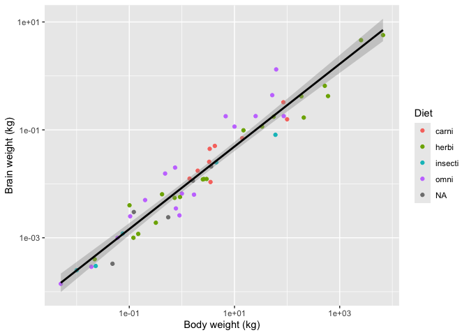<!-- --> \###
lets highlight some particular interesting species

``` r
highlight <- subset(ms, name %in% c("Human", "Chimpanzee", "African elephant",
                                    "House mouse", "Cow"))
ggplot(ms, aes(x = bodywt, y = brainwt)) +
  geom_point(color = "grey60") +
  geom_point(data = highlight, color = "red", size = 2) +
  geom_text(data = highlight, aes(label = name), vjust = -1, size = 3) +
  scale_x_log10() +
  scale_y_log10() +
  labs(x = "Body weight (kg)", y = "Brain weight (kg)")
```

    ## Warning: Removed 27 rows containing missing values or values outside the scale range
    ## (`geom_point()`).

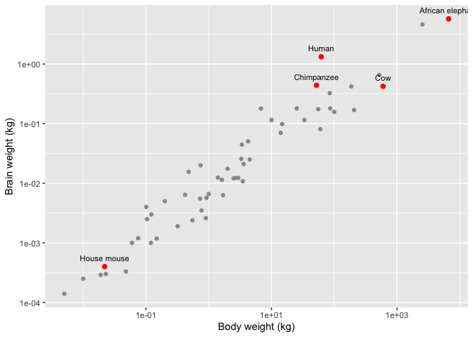<!-- -->

### Hypothesis: do carnivors need more sleep

``` r
ggplot(ms, aes(x = vore, y = sleep_total)) +
  geom_boxplot()
```

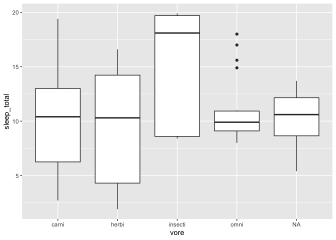<!-- --> I do not
like that the ones without info are a separate group lets remove them

``` r
msv <- subset(ms, !is.na(vore)) # ! means NOT
nrow(msv)
```

    ## [1] 76

``` r
ggplot(msv, aes(x = vore, y = sleep_total)) +
  geom_boxplot()
```

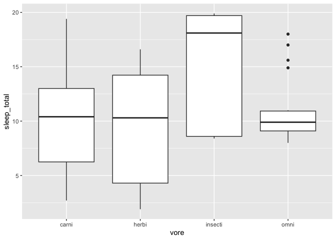<!-- --> It is
sometimes argued that boxplots are not great, as they may hide outliers,
so it could be helpful to actually show the data points as well

``` r
ggplot(msv, aes(x = vore, y = sleep_total)) +
  geom_boxplot(outlier.shape = NA) + # hide outliers, the jitter shows all points anyway
  geom_jitter(width = 0.2, alpha = 0.5) +
  labs(x = "Diet", y = "Total sleep (hours per day)")
```

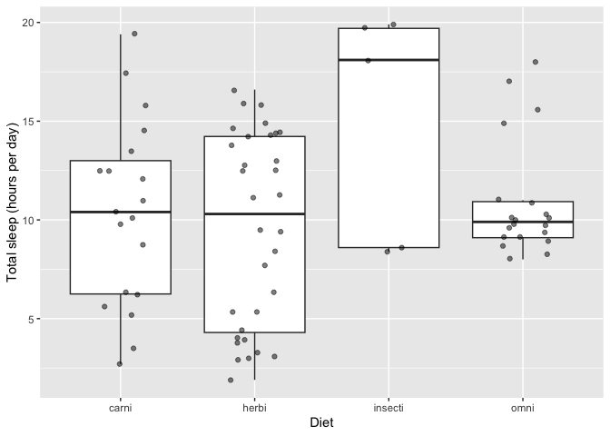<!-- -->

## Faceting - how does sleep and body_weight correlate for different ‘vora’

Either showing colors

``` r
ggplot(msv, aes(x = bodywt, y = sleep_total,color=vore)) +
  geom_point() +
  scale_x_log10() +
  labs(x = "Body weight (kg)", y = "Total sleep (hours per day)")
```

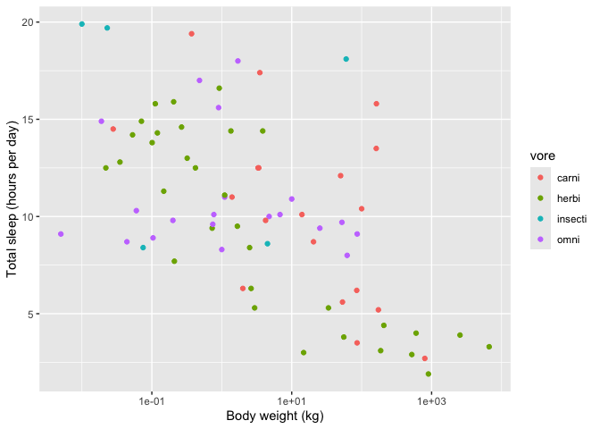<!-- --> Or show
them separately using faceting

``` r
ggplot(msv, aes(x = bodywt, y = sleep_total)) +
  geom_point() +
  scale_x_log10() +
  facet_wrap(~ vore) +
  labs(x = "Body weight (kg)", y = "Total sleep (hours per day)")
```

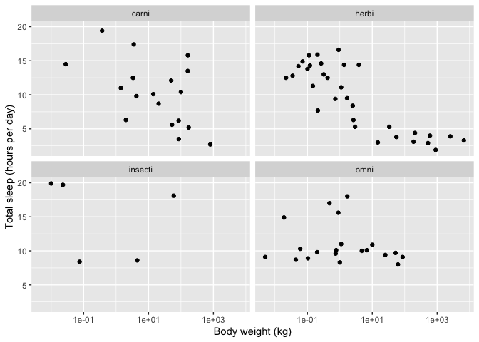<!-- -->

# Assignment until next week

- Do the same with a dataset of your choice.
- Tell me a scientific story in RMarkdown; generate a pdf of the story
  including visualizations with ggplot2 and sent them to
  <biomedpython@gmail.com> by end of next week.
- Be creative and ask questions; tell an interesting story with the
  analysis (not using excessive words)
- You could do it with the lungdeaths; but feel free to use any data set
  of interest (voting behaviour, genetic data, economic development,
  healthcare, etc)
