Exercises in Population Genetics
================
Dr. Robert Kofler

# Introduction

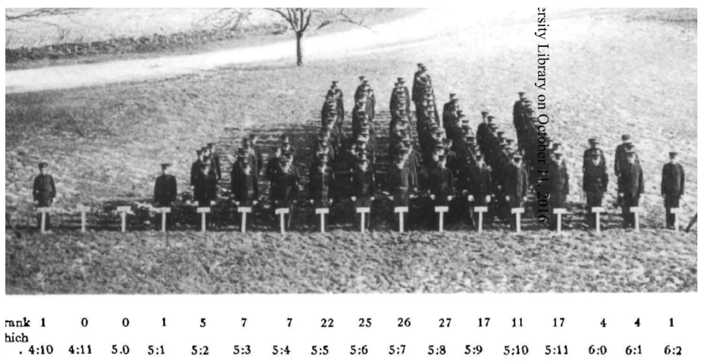

Quantitative genetics deals with phenotypes that vary continuously. Any
examples? Any examples for discontinously (discretly) inherited
phenotypes?

While the genetics basis (ie. the causative SNP) of many discrete traits
can be readily identified, the genetic basis of most quantitative traits
is still unresolved. The genetic basis of quantitative traits is by many
considered as to be the major challenge for biology in the 21th century.

## Theoretical basics

Imagine two flies, fly P1 (parent 1) and fly P2 (parent 2). P1 has a
size of 4mm and P2 a size of 2mm. The mean (P hat) is 3mm. The allele
effect (a) is 1mm. Now we cross P1 and P2 and get flies F1 with a size
of 3.5mm. Here the dominance effect (d) is 0.5.

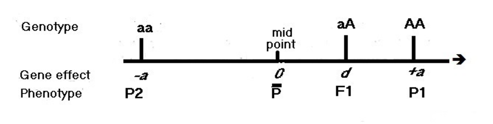

Questions:

- d = 0 anything interesting about this case?
- d = 1
- d = -1
- d = 2
- d = -2

# A simple fly: Introduction to S3 classes

## First a simplification:

Although the bases are A,T,C,G researchers frequently use 0,1 to denote
different alleles. For example 0 could be the ancestral allele (e.g. G)
and 1 the derived allele (e.g A)

``` r
# we start with a list (remember: capable of storing data with different modes)
f<-list(hap1=c(0),hap2=c(1),genotype=1,phenotype=1.2)
```

Question, is this fly homozygous or heterozygous?

- the genotypic value is 1mm, i.e. from the genotype the fly is 1mm
  larger than the average fly
- the phenotypic value is 1.2mm, i.e. the fly is 1.2mm larger than the
  average. How is this possible, what could be the reason?

Than we generate the S3 class simply by setting an attribute

``` r
class(f)<-"fly"
f
```

    ## $hap1
    ## [1] 0
    ## 
    ## $hap2
    ## [1] 1
    ## 
    ## $genotype
    ## [1] 1
    ## 
    ## $phenotype
    ## [1] 1.2
    ## 
    ## attr(,"class")
    ## [1] "fly"

## Why S3 classes?

**Polymorphism** (software engineering! nothing to do with SNPs).

It enables to overload generic functions, like print or plot.

## Infos for the fly

Let’s overload print for the fly

``` r
print.fly<-function(fly)
{
  cat("Fly\nHaplotypes\n",fly$hap1,"\n",fly$hap2,"\n\n")
  cat("Genotype ",fly$genotype,"\n")
  cat("Phenotype ",fly$phenotype,"\n")
}

# now let's print the fly
f # automatic call to print(f)
```

    ## Fly
    ## Haplotypes
    ##  0 
    ##  1 
    ## 
    ## Genotype  1 
    ## Phenotype  1.2

# A fly population

Next we need a population of flies. Noting

``` r
generate_population<-function(ne,p,a,ve)
{
  # ne..population size
  # p...starting allele frequencies (could be a vector)
  # a...additive effect sizes (could be a vector)
  # ve..environmental variance
  
  # number of haplotypes, since flies are diploid
  twone<-2*ne
  
  # first we generate all haplotypes
  haps<-c()
  for(f in p) # for all starting allele frequencies
  {
    # how many 1's and 0's dow we need
    ones<-ceiling(f*twone) 
    zeros<-twone-ones
    # randomly mix them and add to previous ones
    newhaps<-sample(c(rep(0,zeros),rep(1,ones)))
    haps<-c(haps,newhaps)
  }
  m<-matrix(haps,ncol=length(p))
  
  # now we generate our fly population
  pop<-list()
  sd<-sqrt(ve)
  for(i in 1:ne) # for all flies
  {
    # every fly needs two sets of chromosomes
    i2=i*2 # index of haplotype 2
    i1=i2-1 # index of haplotype 1
    hap1<-m[i1,]
    hap2<-m[i2,]
    
    # compute the genotype
    ## 00       = -a
    ## 01 or 10 = 0
    ## 11       = +a
    genotype<-(hap1+hap2-1)*a
    genotype<-sum(genotype) # sum over all loci, snps
    # phenotype is the genotype plus a random component (environmental effect)
    phenotype<-genotype+rnorm(1,sd=sd)
    
    # generate a fly (S3 class)
    fly<-list(hap1=hap1,hap2=hap2,genotype=genotype,phenotype=phenotype)
    class(fly)<-"fly"
    pop[[i]]<-fly
  }
  # generate a population; next S3 class
  class(pop)<-"population"
  # we also store a, ne, ve
  pop$a<-a
  pop$ne<-ne
  pop$ve<-ve
  return(pop)
}
p<-generate_population(10,0.5,1,1)
```

As a result we have a fly population.

Printing this population is lengthy, ugly and uninformative.

``` r
print(p)
```

So, it’s time for **polymorphism**!

``` r
print.population<-function(pop)
{
  ne<-pop$ne
  phen<-unlist(lapply(pop[1:ne], function(x) x$phenotype))
  gen<-unlist(lapply(pop[1:ne], function(x) x$genotype))
  cat("Population\nSize ",ne,"\n")
  cat("Genotype mean ",mean(gen)," Variance",var(gen),"\n" )
  cat("Phenotype mean ",mean(phen)," Variance ",var(phen),"\n" )  
}
p 
```

    ## Population
    ## Size  10 
    ## Genotype mean  0  Variance 0.4444444 
    ## Phenotype mean  -0.1947146  Variance  1.456211

Remember that the command $p$ calls $print(p)$, which - thanks to
polymorphism - calls $print.population(p)$

# Back to theory

## Genotypic variation

$V_G=2pqa^2$

The genotypic variation can be computed from the allele frequency ($p$;
$q=1-p$) and the additive effect.

**Excersice** Test whether this is true with different settings of $p$
and $a$. ($p= 0.1, 0.5$; $a=0.5,1,2$)

## Phenotypic variation

$V_P=V_G+V_E$

The phenotypic variation is the genotypic variation plus the
environmental variation

**Excersice** Test whether this is true with different settings of $V_E$
and $a$. ($V_E=1,2,10$, $a=0.5,1,2$)

# Connecting discrete inheritance with continous variation, an unresolvable conflict?

## Prerequisite: plotting genotypic and phenotypic variation

``` r
plot.population<-function(pop)
{
  library(ggplot2)
  theme_set(theme_bw())

  ne<-pop$ne
  phen<-unlist(lapply(pop[1:ne], function(x) x$phenotype))
  gen<-unlist(lapply(pop[1:ne], function(x) x$genotype))
  t<-c(rep("genotype",ne),rep("phenotype",ne))
  df<-data.frame(type=t,data=c(gen,phen))
  g<-ggplot(df,aes(x=data))+geom_histogram()+facet_grid(.~type)
  plot(g)
}
```

## A battle was raging

The early geneticists hotly debated whether quantitative variation
(continous) is something entirely different than qualitative variation
(discontinous). Even two different modes of inheritance were considered.

Let’s see if we can shed light on this problem…

``` r
# population of size 1000, with one SNP having a starting allele frequency 0.5
# and an effect size of 1; no environmental variation
p<-generate_population(1000, 0.5, 1, 0)
plot(p)
```

    ## `stat_bin()` using `bins = 30`. Pick better value `binwidth`.

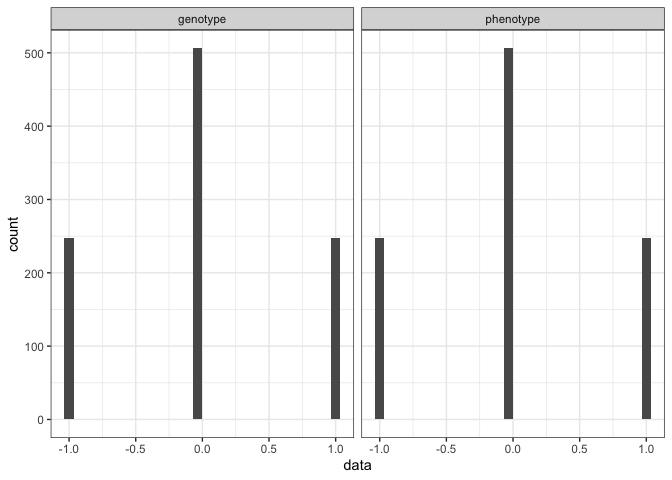<!-- -->

``` r
# nicely our generate_population function can be vectorized
# two SNPs
p<-generate_population(1000,c(0.5,0.5),c(1,1), 0.0)
plot(p)
```

    ## `stat_bin()` using `bins = 30`. Pick better value `binwidth`.

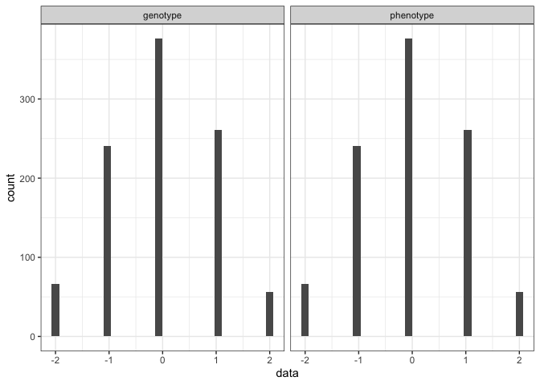<!-- -->

``` r
# three SNPs
p<-generate_population(1000,c(0.5,0.5,0.5),c(1,1,1), 0.0)
plot(p)
```

    ## `stat_bin()` using `bins = 30`. Pick better value `binwidth`.

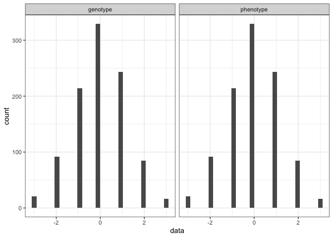<!-- -->

``` r
# four SNPs
p<-generate_population(1000,c(0.5,0.5,0.5,0.5),c(1,1,1,1), 0.0)
plot(p)
```

    ## `stat_bin()` using `bins = 30`. Pick better value `binwidth`.

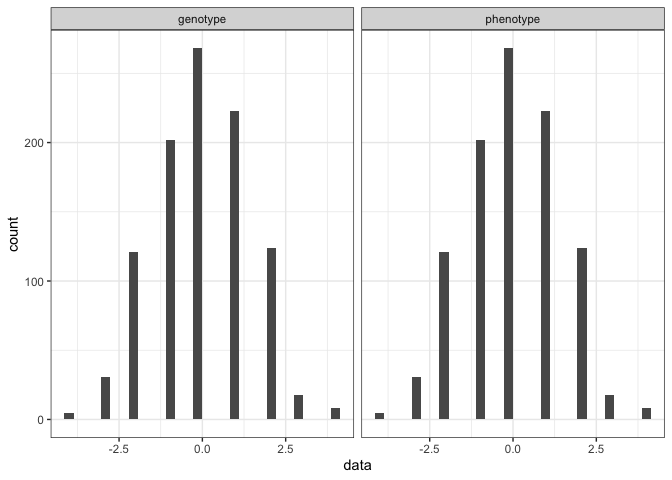<!-- -->

### Environmental effect

And finally, adding some environmental variation:

``` r
p<-generate_population(1000,c(0.5,0.5,0.5,0.5),c(1,1,1,1), 0.2)
plot(p)
```

    ## `stat_bin()` using `bins = 30`. Pick better value `binwidth`.

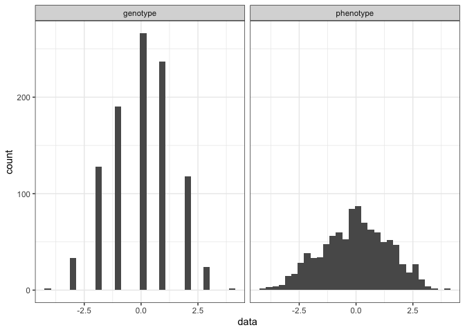<!-- -->

**Question** What do we learn from this? Think about the early
geneticists, it was hotly disputed whether quantitative variation
(continous) is something entirely different than qualitative
(discontinous) variation. How can continous variation and discrete
inheritance be reconciled?

**Exercise**

- What is the influence of the starting allele frequency, e.g.:
  $p=0.1,0.25,0.5,0.9$? Where do we have the most variation?
- What is the influence of the environmental variation?

# Heritability

Heritability is an important statistic for quantitative traits. It
basically states how much of the observed phenotypic variation is due to
genetic variation?

$h^2=\frac{\sigma_G^2}{\sigma_P^2}$

- 0… all observed variation is due to the environment (e.g. body
  builders don’t have muscular kids)
- 1… all observed variation is genetic (e.g. tall parents mostly have
  tall kids)

``` r
heritability<-function(pop)
{
  ne<-pop$ne
  phen<-unlist(lapply(pop[1:ne], function(x) x$phenotype))
  gen<-unlist(lapply(pop[1:ne], function(x) x$genotype))
  hsquare<-var(gen)/var(phen)
  return(hsquare)
}
h<-heritability(generate_population(1000, 0.5,1, 1))
h
```

    ## [1] 0.3143422

Excercises:

- At which environmental variance is the heritability the greatest?
- What is the influence of the starting allele frequency on the
  heritability?

# Breeders equation and truncating selection

## Prerequisite: order()

How to sort a vector in R?

``` r
# given a vector that should be sorted
a<-c(5,4,1,3,2,6,7)
o<-order(a)
sorteda<-a[o]
a
```

    ## [1] 5 4 1 3 2 6 7

``` r
o
```

    ## [1] 3 5 4 2 1 6 7

``` r
sorteda
```

    ## [1] 1 2 3 4 5 6 7

**order()** returns a vector of indices for the given vector a. The
first value in $o$ is the index of the lowest value in $a$, the second
value in $o$ the index of the second lowest value in $a$, etc.

## Breeders equation

So far it was easy to estimate the heritability because we know VP and
VG, but is this a realistic scenario? Which values can be measured when
investigating natural populations?

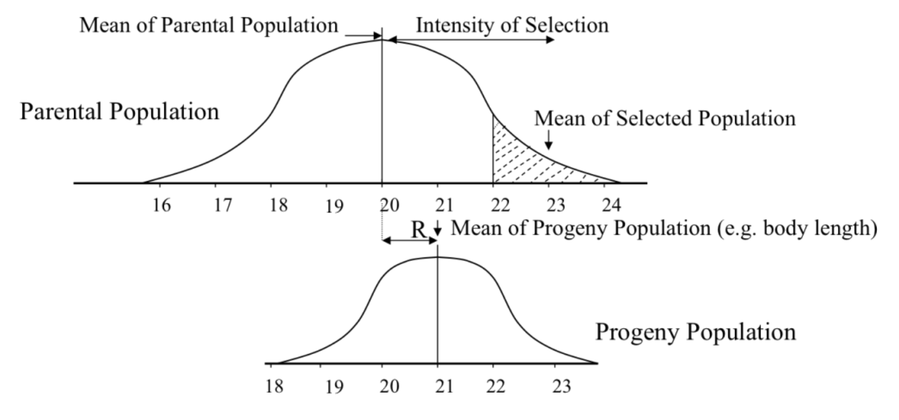

$R=Sh^2$

- S.. selection intensity (difference between mean of population and
  mean of selected population)
- $h^2$.. heritability
- R.. response to selection (difference between mean of population and
  mean of progeny of the selected ones)

**Breeders equation allows to estimate the heritability**

$h^2=R/S$

``` r
truncate<-function(pop,tsf) #tsf to select fraction
{
  # pop the population to select from
  # tsf.. truncating selection frequency; fraction of individuals to select
  ne<-pop$ne
  tsc<-floor(tsf*ne) # how many flies to select
  
  # get all phenotypes and sort them
  phen<-unlist(lapply(pop[1:ne], function(x) x$phenotype))
  o<-order(phen,decreasing=T)
  
  # get the indices of flies to select; simply the first tsc
  # from the vector order; 
  indexts<-o[1:tsc] 
  
  # selected flies form a new population
  tpop<-pop[indexts]
  class(tpop)<-"population"
  tpop$a<-pop$a
  tpop$ne<-tsc
  tpop$ve<-pop$ve
  return(tpop)
}
p<-generate_population(500, rep(0.5,20),rep(1,20), 1)
tp<-truncate(p,0.1)
```

Now let’s compare the original population and the truncated population

``` r
p
```

    ## Population
    ## Size  500 
    ## Genotype mean  0  Variance 10.49699 
    ## Phenotype mean  0.04483322  Variance  12.04393

``` r
tp
```

    ## Population
    ## Size  50 
    ## Genotype mean  5.28  Variance 3.226122 
    ## Phenotype mean  5.921691  Variance  2.632645

``` r
plot(p)
```

    ## `stat_bin()` using `bins = 30`. Pick better value `binwidth`.

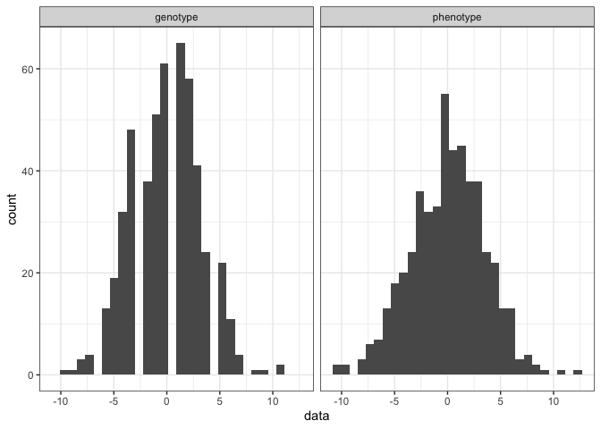<!-- -->

``` r
plot(tp)
```

    ## `stat_bin()` using `bins = 30`. Pick better value `binwidth`.

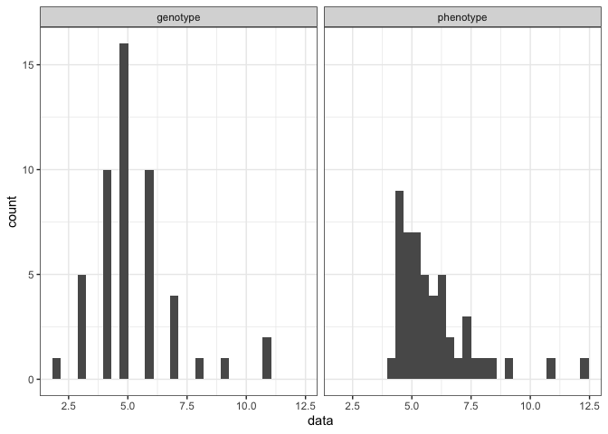<!-- -->

So let’s compute $S$

``` r
# overloading mean; we use the phenotype
mean.population<-function(pop)
{
  ne<-pop$ne
  phen<-unlist(lapply(pop[1:ne], function(x) x$phenotype))
  return(mean(phen))
}
s<-mean(tp)-mean(p)
s
```

    ## [1] 5.876857

To estimate the heritability we also need to know $R$, which requires
the mean fitness of the progeny. Let’s get the next generation for our
population. We allow the selected flies to mate randomly.

``` r
next_generation<-function(pop,ne)
{
  # pop.. the population that should mate randomly
  # ne... the target population size
  sd<-sqrt(pop$ve)
  ng<-list()
  snps<-length(pop$a)
  for(i in 1:ne) 
  {
    # get the index of the two flies that are going to mate
    ix<-sample(1:pop$ne,2,replace=T)
    # get the two lucky flies from the population
    f1<-pop[[ix[1]]]
    f2<-pop[[ix[2]]]
    
    # get the two random assortments
    # we assume every SNP is on a different chromosome
    ra1<-sample(0:1,snps,replace=T)
    ra2<-sample(0:1,snps,replace=T)
    
    # get the two gametes
    sperm<- ifelse(ra1>0,f1$hap1,f1$hap2)
    ovary<- ifelse(ra2>0,f2$hap1,f2$hap2)

    # compute genotype and phenotype
    genotype<-sperm+ovary-1
    genotype<-sum(genotype*pop$a)
    phenotype<-genotype+rnorm(1,sd=sd)
    
    # get a new fly
    newfly<-list(hap1=sperm,hap2=ovary,genotype=genotype, phenotype=phenotype)
    class(newfly)<-"fly"
    ng[[i]]<-newfly
  }

  ng$a<-pop$a
  ng$ve<-pop$ve
  ng$ne<-ne
  class(ng)<-"population"
  return(ng)
}


ng<-next_generation(tp,p$ne)
plot(ng)
```

    ## `stat_bin()` using `bins = 30`. Pick better value `binwidth`.

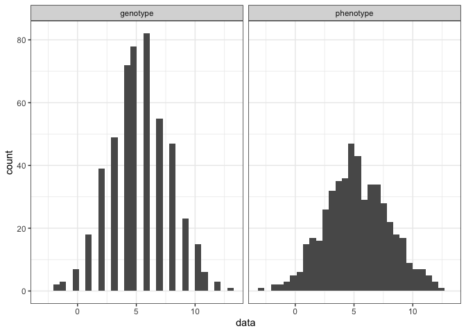<!-- -->

``` r
r<-mean(ng)-mean(p)
r
```

    ## [1] 5.206316

``` r
# finally, we can estimate the heritability
hsquare<-r/s
hsquare
```

    ## [1] 0.8859014

``` r
# compared to the direct estimate (not available to biologists) 
hdir<-heritability(p)
hdir
```

    ## [1] 0.8715592

# SimFarm3

Imagine you are a plant breeder and you have ten years (say 10
generations) to breed a wheat cultivar having the highest possible
yield. If you succeed you will get rich because every farmer wants to
buy your super-seeds.

We start with the following wheat population:

``` r
p<-generate_population(1000, rep(0.5,200),rep(1,200), 0)
```

Next we need a function for repeated truncating selection.

``` r
multi_truncate<-function(pop,generations,tsf)
{
  ng<-pop
  ne<-pop$ne
  for(i in 1:generations)
  {
    tp<-truncate(ng,tsf)
    ng<-next_generation(tp,ne)
  }
  return(ng)
}
```

Now we select for 10 years

``` r
superyieldwheat<-multi_truncate(p,10,0.5)
print(p)
```

    ## Population
    ## Size  1000 
    ## Genotype mean  0  Variance 94.88088 
    ## Phenotype mean  0  Variance  94.88088

``` r
print(superyieldwheat)
```

    ## Population
    ## Size  1000 
    ## Genotype mean  64.796  Variance 56.15454 
    ## Phenotype mean  64.796  Variance  56.15454

**Exercises**

- Maximize the yield of your wheat within 10 generations! Whoever has
  the highest yielding wheat cultivar wins! Theoretically possible is a
  genotype of +200!
- What is the influence of the heritability (environmental variation)?
  Does it make your task harder or easier?
- Can you think of creative strategies to increase the yield even
  further? Implement them.
